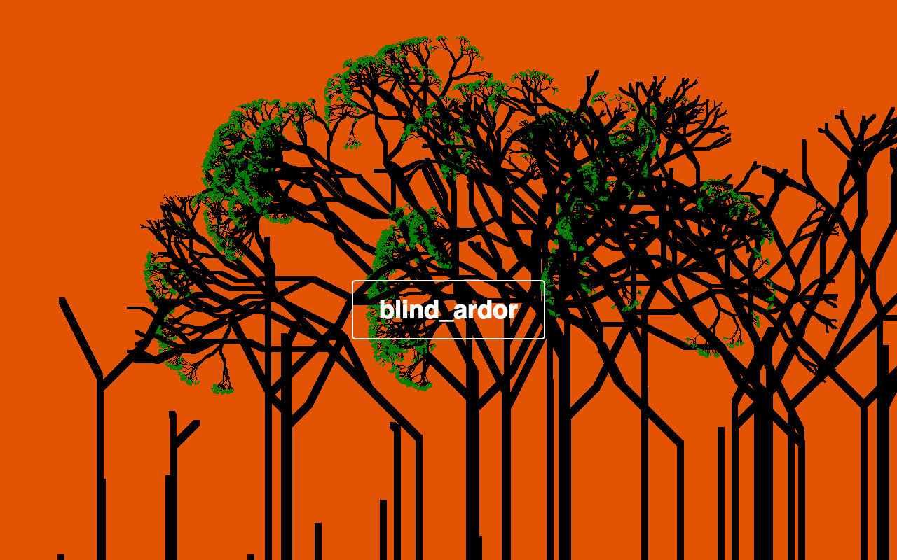
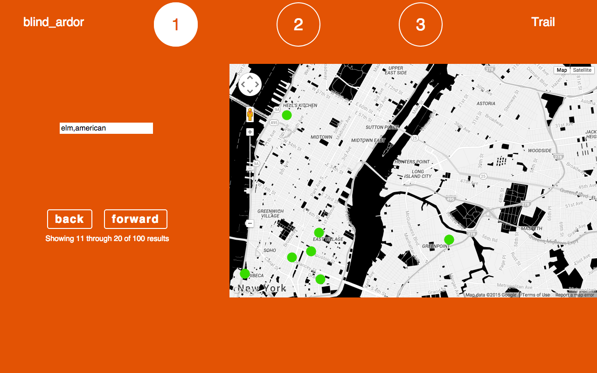
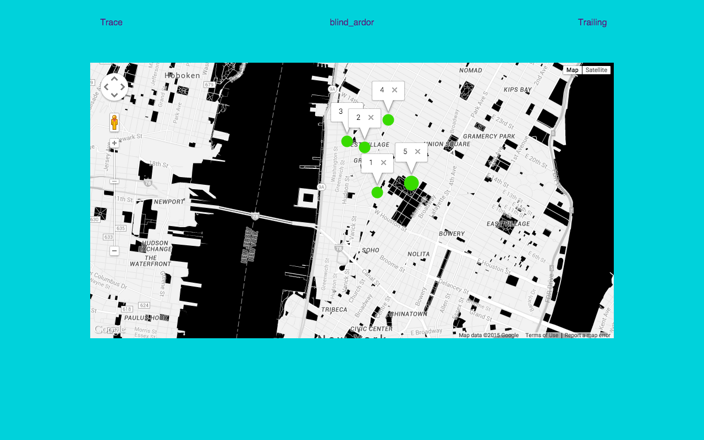
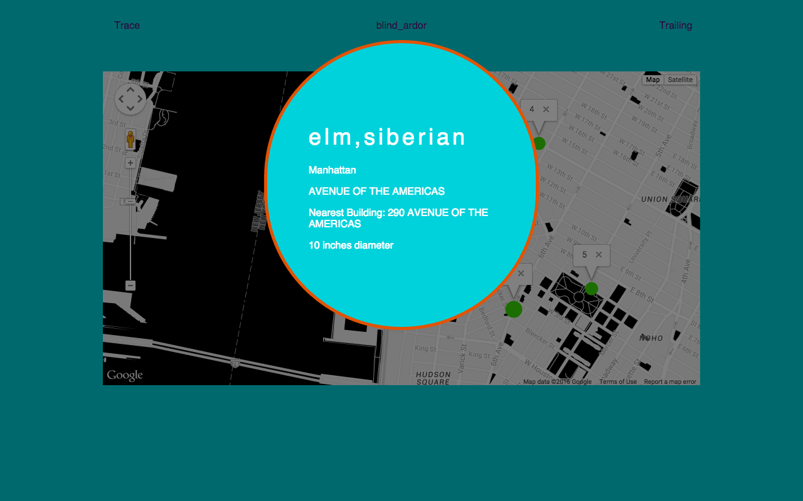

# blind_ardor

### A tree-trail creation app based on NYC's street tree census data.

----

### The Stack:
* __Postgresql__ to hold all those trees and trails.
* __Rails__ to serve the front end with a custom API.
* __Backbone__ to render an elegant and maintainable Single Page App.

### Other Technologies:
* __Google Maps API__
* __Semantic-ui-grid__
* __jquery__ and __jquery-ui__ for dragging and dropping.
* __mustache__ for mostly logicless templates.
* __typeahead__ to provide autocompletion for tree searches.

### The Plan:
* <h4> A user can create a tree trail so that they can delight other people. This implies two roles:</h4>
  * __The tree-trail designer__ can:
    * see a map of NYC and can layer trees on top so that they can decide which trees should be on the path.
    * select a tree to be on the path so that it becomes a stop.
    * order the stops on a path so they can curate the experience.
  * __The tree-trail follower__ can:
    * see a list of possible paths so that they can decide which one to take.
    * see step by step path stops so they can follow a path.
* #### Entity Relationship Diagram:

### Screenshots:

